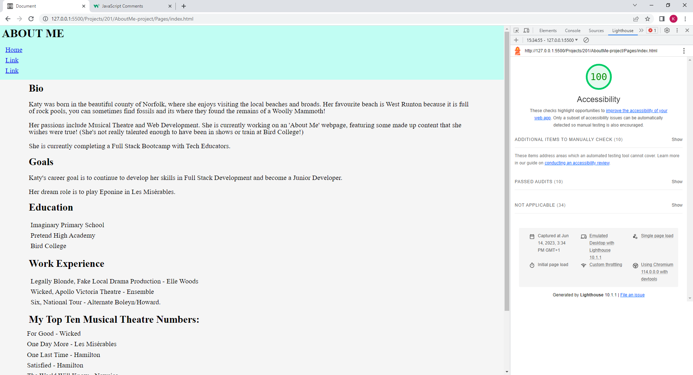
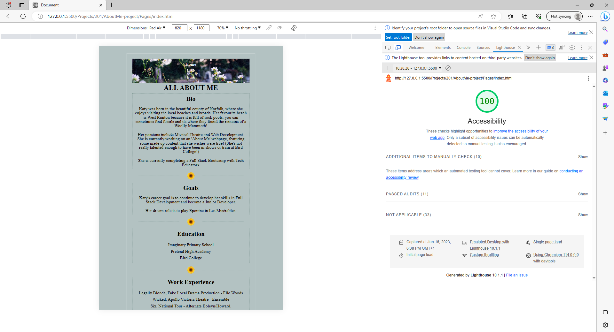

# AboutMe-project

I am making an About Me page.

In JavaScript I am using while loops and conditionals to make an interactive quiz that can only be answered with yes/no or y/n.

**Lighthouse Score after Lab 2**

****Lighthouse Score after Lab 5**

---

## Images used:
[Photo by freestocks.org from Pexels](https://www.pexels.com/photo/closeup-photography-of-white-clustered-flowers-380915/)

[Image by Myriam]("https://pixabay.com/users/eleatell-15115856/?utm_source=link-attribution&utm_medium=referral&utm_campaign=image&utm_content=6144274) from [Pixabay](https://pixabay.com//?utm_source=link-attribution&utm_medium=referral&utm_campaign=image&utm_content=6144274)